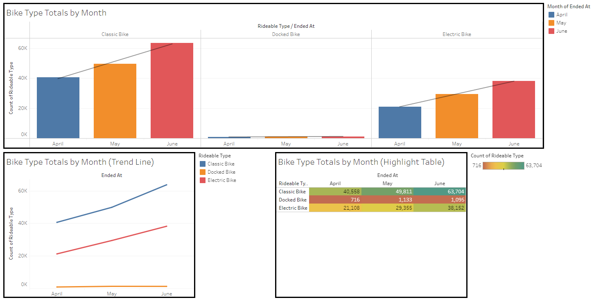
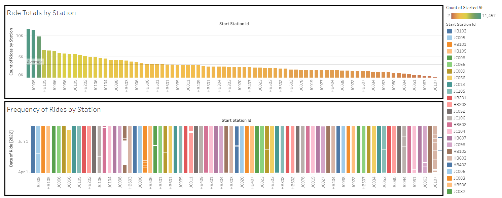
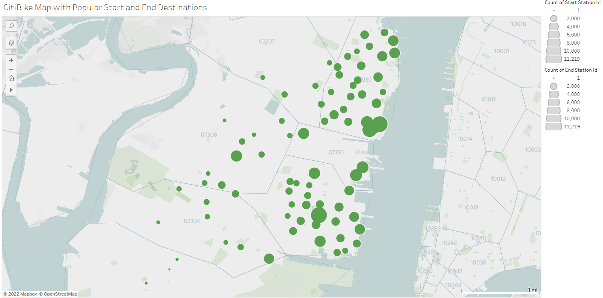
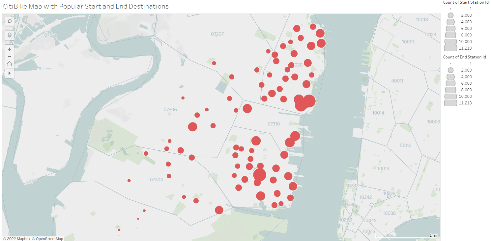

# CitiBike Analysis

The purpose of this project is to aggregate data from the CitiBike program and present the information using visuals and providing analysis. The datasets used were from April, May, and June of 2022. The data visuals and analysis can be found below.

## Analysis
The submitted analysis should include all of the following: 
✓ Analysis on both uncovered phenomena, using the dashboards as a visual guide
✓ Analysis on the chosen city official requested map detailing any noticeable trends
✓ Both write-ups are logically sound
✓ Write-ups are written in a manner that a non-data scientist/analyst could understand

The image below shows a few graphs used to show the different ride types and how their amounts change over the course of the observed data timeframe. The bar graph shows that all ride types see an increase usage over the course of the three observed months. However, it must be noted that the docked bike type is seeing very limited usage compared the classic and electric bike. Furthermore, the trendline is showing that the growth for docked bikes is much lower than the other bike types. The line graph shows similar information. However, in isolation, the lines allow us to confirm that the growth for docked bikes is much less significant. Finally, the highlight table shows the raw number of uses for each bike type. The red color for the docked bikes indicates that it seems much less usage. Conversely, the classic bike is the most popular bike option. 

