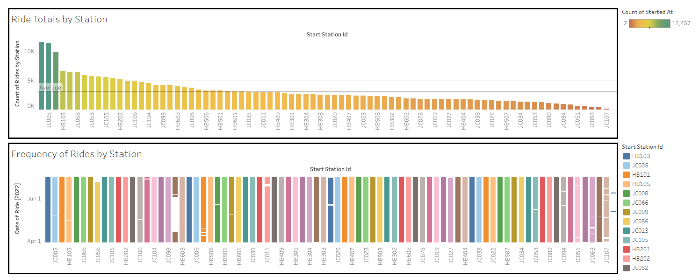

# CitiBike Analysis

The purpose of this project is to aggregate data from the CitiBike program and present the information using visuals and providing analysis. The datasets used were from April, May, and June of 2022. The data visuals and analysis can be found below.

## Analysis

The image below shows a few graphs used to show the different ride types and how their amounts change over the course of the observed data timeframe. The bar graph shows that all ride types see an increase usage over the course of the three observed months. However, it must be noted that the docked bike type is seeing very limited usage compared the classic and electric bike. Furthermore, the trendline is showing that the growth for docked bikes is much lower than the other bike types. The line graph shows similar information. However, in isolation, the lines allow us to confirm that the growth for docked bikes is much less significant. Finally, the highlight table shows the raw number of uses for each bike type. The red color for the docked bikes indicates that it seems much less usage. Conversely, the classic bike is the most popular bike option. 

The image below shows a couple graphs used to show total number of rides per station as well as the frequency of rides for each station. The bar graph at the top of the image shows the total rides station as well as a line indicating the overall average number of rides. Additionally, the stations are sorted in descending order based on the total number of rides for that station. Based on the color coding (the green-hued bars) and the "average" line, most stations operate below the average number of rides. This is because of the stations with green bars have such heavy ridership that they cause the average to be higher than most other stations' total ridership. The frequency of rides graph is very interesting and reveals unusual data. Like the bar graph above it, it is sorted in descending order. Each station has its own color to make them easily distinguishable. Simply put, fewer white spaces means that the ride frequency is higher for that station and it is being consistently used. This explains why stations furtherest to the right on the graph have much more white space in their bars. One interesting station is HB102, the station with the brown bar and the noticable white space. This white space indicates that there was a period of time where the station was not in use. However, despite this period of inactivity, the overall usage for this station is still makes it one of the most active stations.

The two images below show the start and end destinations, respectively. In each map, the circles indicate the location of each station. The size of the circle indicates how many times someone started at that station (green circles) or ended at that station (red circles). This, in essence, tells us the popularity of each station. Upon initial inspection, popular start stations also appear to be popular end stations as well. Most of the stations are concentrated in zip codes 07302 and 07030. This is also where most of the popular stations are located. Conversely, stations located further south are sparse and also not used as frequently. Roughly speaking, it appears as though stations located further from the island of Manhattan are less frequently used.  

